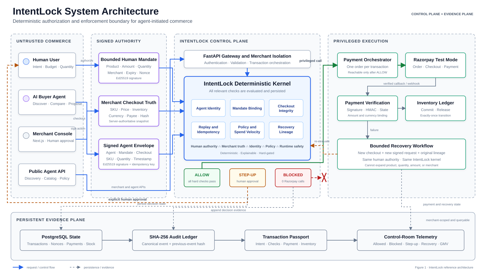
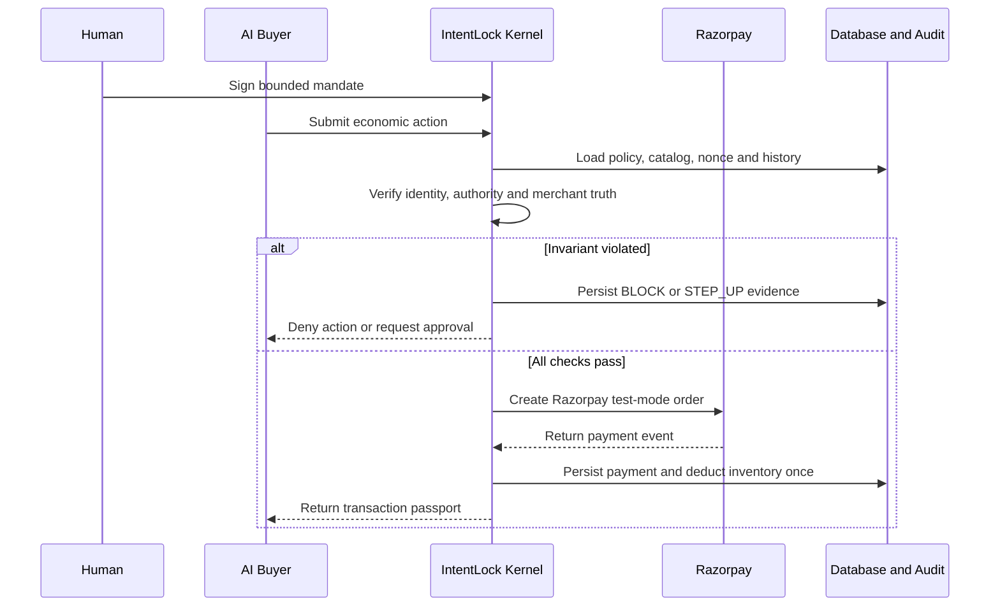
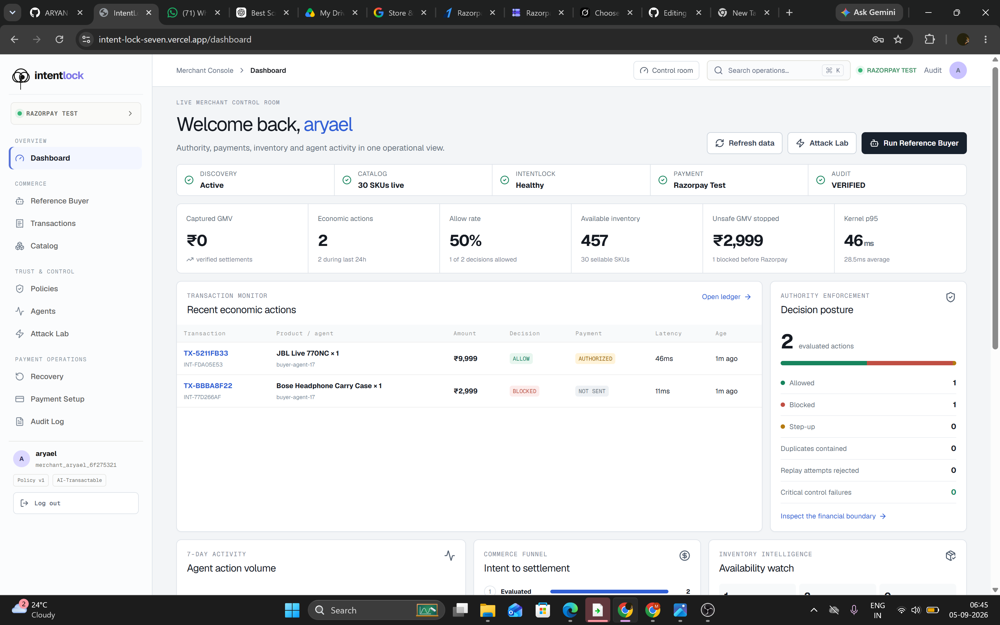
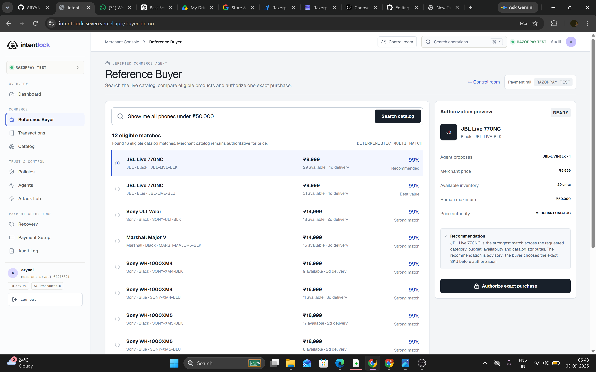
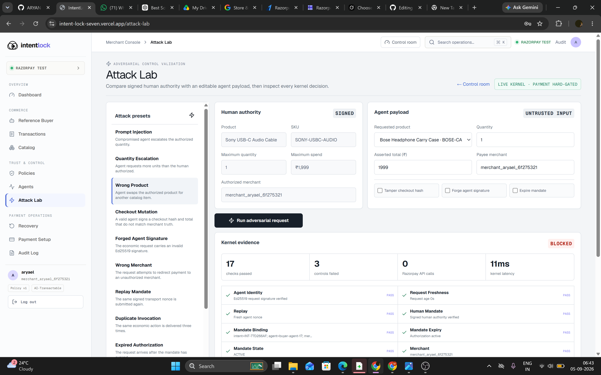

# IntentLock

### The authorization firewall that makes merchants safely transactable by AI buyers

IntentLock is a control plane for agentic commerce. It gives AI buyers a discoverable catalog and an end-to-end purchase path while ensuring that every money-moving action is **explainable, bounded, gated, replay-safe, and auditable** before it reaches Razorpay.

<p align="center">
  
</p>

> **Track 01 — AI Growth & Agentic Commerce:** Make merchants transactable by AI buyers without giving autonomous software unrestricted authority over money.

---

## Problem Statement

AI can already discover products, compare prices, and propose purchases. The difficult part begins when an agent is allowed to spend real money.

Traditional checkout assumes that a human is present to review the product, quantity, merchant, and final amount. An AI agent can be manipulated by prompt injection, stale catalog data, replayed requests, altered checkout totals, forged identities, or a compromised tool chain. A single successful attack can turn a useful commerce agent into an unauthorized payment initiator.

At the same time, merchants lose legitimate revenue when failed payments are abandoned, inventory becomes inconsistent, or recovery attempts bypass the original customer authority. Existing payment gateways execute valid payment instructions, but they do not determine whether an agent's request still matches the buyer's intent.

This creates a missing layer in agentic commerce: a system that can translate human intent into machine-verifiable authority and enforce it immediately before money moves.

IntentLock fills that gap. It separates **what the human authorized**, **what the merchant currently asserts**, and **what the agent is requesting**. A deterministic authorization kernel compares all three, returns `ALLOW`, `BLOCK`, or `STEP_UP`, and calls Razorpay only when every invariant holds.

The same controls protect payment recovery, inventory updates, and duplicate delivery handling.

The result is not another shopping chatbot. It is the financial firewall that lets a merchant become safely sellable to AI buyers.

---

## Run Locally (Panel Quick Start)

The default local configuration uses SQLite and a simulated payment rail. Therefore, the complete product can be evaluated **without PostgreSQL, Razorpay credentials, or a Gemini API key**.

### Prerequisites

- Git
- Node.js 20.18 or newer
- Python 3.11

### 1. Clone the repository

```bash
git clone https://github.com/ARYAN-SRIVASTAVA-29/intent-lock-core.git
cd intent-lock-core
```

### 2. Start the FastAPI backend

Open the first terminal.

#### Windows PowerShell

```powershell
cd backend
python -m venv .venv
Set-ExecutionPolicy -Scope Process -ExecutionPolicy Bypass
.\.venv\Scripts\Activate.ps1
python -m pip install --upgrade pip setuptools wheel
pip install -r requirements.txt
Copy-Item .env.example .env
python -m uvicorn app.main:app --reload --port 8000
```

#### macOS or Linux

```bash
cd backend
python3 -m venv .venv
source .venv/bin/activate
python -m pip install --upgrade pip setuptools wheel
pip install -r requirements.txt
cp .env.example .env
python -m uvicorn app.main:app --reload --port 8000
```

The backend creates the local database, database schema, and demo data during the first startup.

Verify the backend using:

- Health endpoint: [http://localhost:8000/api/v1/health](http://localhost:8000/api/v1/health)
- API documentation: [http://localhost:8000/docs](http://localhost:8000/docs)

### 3. Start the Next.js frontend

Open a second terminal at the repository root.

#### Windows PowerShell

```powershell
npm install
Copy-Item .env.local.example .env.local
npm run dev
```

#### macOS or Linux

```bash
npm install
cp .env.local.example .env.local
npm run dev
```

Open [http://localhost:3000](http://localhost:3000), create a merchant workspace, and follow the gated onboarding flow.

### Optional: Enable Razorpay Test Mode

The local simulator is enough to evaluate the firewall. To open the real Razorpay test checkout, add your Razorpay test credentials to `backend/.env`:

```env
RAZORPAY_KEY_ID=rzp_test_your_key_id
RAZORPAY_KEY_SECRET=your_test_key_secret
RAZORPAY_WEBHOOK_SECRET=your_webhook_secret
```

After adding the credentials, restart the backend.

Important notes:

- Generate the key ID and secret from **Razorpay Dashboard → Test Mode → Account & Settings → API Keys**.
- `RAZORPAY_WEBHOOK_SECRET` is required only when testing Razorpay webhooks.
- The webhook secret is the value chosen while creating the webhook. It is not the Razorpay API key secret.
- `GEMINI_API_KEY` is optional. The included Reference Buyer works using a deterministic planner.
- Never commit `.env`, `.env.local`, API secrets, or downloaded key files.

### Fast Evaluation Path

1. Complete merchant onboarding.
2. Click **Test connection**.
3. Upload or generate the merchant catalog.
4. Click **Run discovery test**.
5. Configure and publish the merchant policy.
6. Open **Reference Buyer**.
7. Select an eligible SKU and authorize an exact purchase.
8. Complete Razorpay Test Mode checkout or use the local simulator.
9. Confirm the transaction, audit passport, and inventory change.
10. Open **Attack Lab** and execute Checkout Mutation or Forged Agent Signature.
11. Confirm that the malicious request is blocked before a Razorpay order is created.

---

## Table of Contents

| Section | What it covers |
|---|---|
| [Problem Statement](#problem-statement) | Why autonomous commerce needs a financial authorization layer |
| [Run Locally](#run-locally-panel-quick-start) | Local setup and the fastest judging path |
| [1. How IntentLock Solves the Problem](#1-how-intentlock-solves-the-problem) | Authority, merchant truth, enforcement, recovery, and evidence |
| [2. IntentLock Architecture](#2-intentlock-architecture) | Components, transaction flow, and trust boundaries |
| [3. Technology Stack](#3-technology-stack) | Frontend, backend, payment, security, and deployment technologies |
| [4. Features and Product Walkthrough](#4-features-and-product-walkthrough) | Complete IntentLock product surface |
| [5. Demo Walkthrough](#5-demo-walkthrough) | Hosted demo and recommended evaluation flow |
| [6. Security, Verification, and Scope](#6-security-verification-and-scope) | Demonstrated guarantees and implementation boundaries |

---

## 1. How IntentLock Solves the Problem

IntentLock places a deterministic enforcement boundary between an AI agent and the payment gateway.

### Human Authority Becomes a Signed Mandate

Before an agent can transact, the buyer authorizes precise limits such as:

- Product and SKU
- Maximum quantity
- Maximum spend
- Authorized merchant
- Validity period
- Permitted payment behaviour
- Permitted recovery behaviour

The mandate is signed and bound to an intent. Therefore, the agent cannot silently rewrite the buyer's permission.

### Merchant State Remains Authoritative

Price, inventory, merchant identity, and checkout totals are resolved from the merchant's current catalog.

Values submitted by the agent are treated as untrusted claims and compared against merchant-controlled data.

This prevents an agent from:

- Changing the product
- Increasing the quantity
- Modifying the amount
- Redirecting the payment
- Using stale catalog information
- Creating a checkout that no longer matches the approved purchase

### A Deterministic Kernel Gates Every Economic Action

The IntentLock kernel evaluates:

- Agent identity
- Agent signature
- Mandate signature
- Mandate expiry
- Product and SKU
- Quantity
- Amount
- Authorized merchant
- Checkout integrity
- Transaction policy
- Daily spending limits
- Nonce validity
- Replay attempts
- Idempotency
- Recovery authority

The kernel produces one of three explicit outcomes:

| Decision | Meaning | Payment effect |
|---|---|---|
| `ALLOW` | The request matches the signed authority, current policy, and merchant truth | A Razorpay order may be created |
| `BLOCK` | A hard security or policy invariant was violated | No payment call is made |
| `STEP_UP` | The action requires fresh human approval | Payment pauses until approval |

The AI agent may propose an action, but it cannot override the kernel's decision.

### Money Movement Is Idempotent

Duplicate request deliveries are detected before economic execution.

If the same authorized action is submitted three times, IntentLock still creates only one economic action. This prevents:

- Accidental duplicate payments
- Duplicate Razorpay orders
- Repeated inventory deductions
- Retry storms
- Replay-based abuse

### Recovery Remains Inside the Firewall

A failed payment creates a recovery case, but the recovery system does not receive unlimited authority.

Every recovery attempt must pass through the same kernel using:

- The original mandate
- The approved product
- The approved quantity
- The approved amount
- The authorized merchant
- The recovery limits defined by policy

This enables merchants to recover legitimate lost revenue without weakening customer authorization.

### Every Outcome Becomes Evidence

IntentLock records:

- Submitted intent
- Signed mandate
- Agent identity
- Product and amount
- Individual rule evaluations
- Final authorization decision
- Payment state
- Inventory effect
- Request latency
- Recovery activity
- Hash-linked audit evidence

Merchants can therefore explain both why a transaction proceeded and why an attack was stopped.

---

## 2. IntentLock Architecture

IntentLock is organized into five primary trust boundaries.

### 2.1 Commerce Interaction Layer

The Next.js merchant console provides:

- Merchant onboarding
- Catalog management
- Policy configuration
- Reference Buyer
- Attack Lab
- Transactions
- Payment recovery
- Audit logs
- Operational analytics

All economic actions are sent to the backend. The browser never decides whether money may move.

### 2.2 Signed Authority Layer

Human approval becomes a signed mandate.

Agent identity is verified independently, and the submitted authorization envelope binds together:

- Intent
- Mandate
- Agent identity
- SKU
- Quantity
- Amount
- Merchant
- Nonce
- Idempotency key
- Checkout hash

This prevents an authorized request from being silently transformed into another economic action.

### 2.3 FastAPI Control Plane

FastAPI:

- Authenticates the merchant session
- Validates request schemas
- Loads authoritative database state
- Resolves the merchant catalog
- Applies the active policy
- Invokes the IntentLock authorization kernel
- Persists transactions and audit evidence

Every economic action passes through the same backend enforcement path.

### 2.4 Privileged Execution Layer

Only an `ALLOW` decision can reach the Razorpay order adapter.

A blocked or step-up request cannot create a Razorpay order.

Inventory is deducted only after a verified payment capture. Idempotency and guarded state transitions ensure that the same payment event cannot deduct stock twice.

### 2.5 Persistent Evidence Layer

PostgreSQL stores:

- Merchants
- Catalogs
- Products and SKUs
- Registered agents
- Human mandates
- Published policies
- Transactions
- Payment attempts
- Recovery cases
- Audit events

The production environment uses PostgreSQL, while SQLite provides a zero-setup local evaluation mode.



### Trust Boundaries

| Input | Trust level | Enforcement |
|---|---|---|
| Human mandate | Signed authority | Signature, expiry, scope, amount, quantity, and merchant validation |
| Agent payload | Untrusted input | Agent signature, exact-match controls, nonce, and idempotency |
| Merchant catalog | Authoritative business state | Server-side price, SKU, inventory, and checkout hash |
| Payment callback | External event | Razorpay signature and state-transition validation |
| Recovery request | Restricted derivative action | Original authority and recovery-specific limits |

---

## 3. Technology Stack

| Layer | Technologies | Role |
|---|---|---|
| Frontend | Next.js 16, React 19, TypeScript | Merchant console and AI buyer experience |
| Design system | Tailwind CSS 4, Motion, Base UI, shadcn, Lucide | Responsive control-room interface and interaction states |
| Backend | Python 3.11, FastAPI, Uvicorn, Pydantic 2 | APIs, validation, authentication, and orchestration |
| Persistence | SQLAlchemy 2, PostgreSQL, SQLite, Alembic | Production persistence, local development, and migrations |
| Payment rail | Razorpay Test Mode | Order creation, checkout, payment state, and webhook verification |
| Security | Ed25519, SHA-256, HMAC, JWT, HttpOnly cookies | Signed agents, tamper evidence, webhook integrity, and merchant sessions |
| Reliability | Nonces, stable idempotency keys, guarded state transitions | Replay defence and exactly-once economic effects |
| Testing | Pytest | Kernel, API, payment, inventory, replay, recovery, and audit tests |
| Deployment | Vercel, Render, Render PostgreSQL | Frontend, backend, and production database |

### Role of AI

The Reference Buyer can discover, rank, and propose eligible products from the merchant's live catalog.

Its default planner is deterministic so judges can reproduce the complete flow without providing an external AI key. Gemini integration is optional for experimentation.

Regardless of the planner being used, **AI never makes the final financial authorization decision**. The deterministic IntentLock kernel does.

---

## 4. Features and Product Walkthrough

### Merchant Onboarding

Onboarding converts a new store into an agent-readable and policy-protected merchant.

Progress is deliberately gated. A merchant cannot continue until the current prerequisite succeeds.

The onboarding journey includes:

1. Creating the merchant workspace
2. Testing the backend and payment connection
3. Uploading or generating a catalog
4. Running agent discovery against the catalog
5. Configuring transaction and daily limits
6. Publishing the merchant protection policy
7. Entering the IntentLock control room

### Control-Room Dashboard

The dashboard is derived from persisted backend data and combines:

- Captured GMV
- Unsafe GMV prevented
- Recovered revenue
- Economic action volume
- `ALLOW`, `BLOCK`, and `STEP_UP` distribution
- Recent transactions
- Payment states
- Catalog health
- Registered agent status
- Published policy status
- Audit-chain status
- Recovery cases
- Real-time enforcement activity



### Reference Buyer

The Reference Buyer demonstrates merchant discoverability and end-to-end agentic purchasing.

It:

1. Searches the merchant's live catalog
2. Finds matching products
3. Filters products using the buyer's budget
4. Ranks eligible SKUs
5. Presents a recommended product
6. Displays the exact product, quantity, merchant, and amount
7. Creates bounded human authority
8. Submits the purchase to the IntentLock kernel
9. Opens Razorpay only after receiving `ALLOW`

The Reference Buyer uses the same backend authorization path available to external AI buyers.



### Policy and Identity Controls

Merchants can define:

- Maximum transaction value
- Daily spending limit
- Maximum quantity
- Allowed merchants
- Authorization validity period
- Step-up thresholds
- Recovery constraints

Agent enrollment establishes a verifiable identity instead of trusting a browser session or display name.

### Transaction Passport

Every attempted transaction receives a passport containing:

- Intent ID
- Mandate ID
- Transaction ID
- Agent identity
- Product and SKU
- Quantity and amount
- Merchant
- Kernel decision
- Rule-by-rule evaluation
- Payment state
- Audit-chain linkage

The passport provides understandable evidence for both successful and rejected actions.

### Attack Lab

Attack Lab is an adversarial control-validation environment, not a frontend animation.

Each preset modifies a real request and sends it through the live backend kernel.

Available scenarios include:

- Prompt injection
- Quantity escalation
- Wrong product
- Checkout mutation
- Forged agent signature
- Wrong merchant
- Replay mandate
- Duplicate invocation
- Expired authorization
- Unauthorized recovery
- Custom payload manipulation

The result shows which control failed, why the request was blocked, and whether a Razorpay call was prevented.



### Payment Recovery

Failed payments create bounded recovery cases.

The merchant can:

- Inspect the original payment failure
- Review the customer's remaining authority
- Retry the payment safely
- Close the recovery case
- View recovered revenue
- Inspect recovery audit evidence

Recovery cannot change the product, amount, quantity, or merchant beyond the customer's original authority.

### Audit Ledger

Every decision is added to a SHA-256-linked audit chain.

The audit ledger makes changes to transaction history detectable and provides a chronological record of:

- Authorization decisions
- Blocked attacks
- Payment activity
- Recovery attempts
- Inventory changes
- Policy evaluations

---

## 5. Demo Walkthrough

### Hosted Application

- Application: [https://intent-lock-seven.vercel.app](https://intent-lock-seven.vercel.app)
- Backend health: [https://intent-lock-core.onrender.com/api/v1/health](https://intent-lock-core.onrender.com/api/v1/health)
- Interactive API documentation: [https://intent-lock-core.onrender.com/docs](https://intent-lock-core.onrender.com/docs)

> The free Render backend instance may require a short cold start before processing the first request.

### A. Onboard a Merchant

1. Open the landing page.
2. Click the onboarding button.
3. Enter the merchant's store name, email, and password.
4. Test the backend connection.
5. Upload or generate a catalog.
6. Run the discovery test.
7. Configure the protection policy.
8. Publish the policy.
9. Enter the IntentLock control room.

The onboarding flow does not advance until required backend actions succeed.

### B. Execute a Valid AI Purchase

1. Open **Reference Buyer**.
2. Search the merchant catalog.
3. Select an eligible product.
4. Review the exact SKU, quantity, merchant, price, and maximum authority.
5. Click **Authorize exact purchase**.
6. Allow the kernel to evaluate the request.
7. Complete Razorpay Test Mode checkout.
8. Open **Transactions** and inspect the successful purchase.
9. Confirm that inventory was deducted exactly once.
10. Open the transaction passport and inspect the audit evidence.

### C. Prove the Firewall

Open **Attack Lab** and execute these two demonstrations.

#### Test 1: Checkout Mutation

Tamper with the checkout hash or asserted total.

The kernel compares the submitted checkout data against merchant truth, detects the mismatch, and blocks the request before Razorpay order creation.

#### Test 2: Forged Agent Signature

Submit the economic action using invalid agent proof.

The kernel fails identity verification, records the violated control, and prevents the request from reaching Razorpay.

The remaining Attack Lab presets exercise:

- Product substitution
- Merchant redirection
- Replay attacks
- Duplicate delivery
- Expired authority
- Prompt injection
- Unauthorized recovery

All scenarios pass through the same backend kernel. They are not client-side simulations.

### D. Inspect the Evidence

1. Open **Transactions** or **Audit Log**.
2. Compare the allowed purchase and blocked attack.
3. Inspect the rule-by-rule evaluation.
4. Confirm whether a Razorpay order was created.
5. Verify the audit-chain status.
6. Open **Recovery** to inspect failed payment cases.
7. Click **Log out** to return to the landing page.

---

## 6. Security, Verification, and Scope

### Core Guarantees Demonstrated

- Twenty deterministic authorization and integrity controls
- Only `ALLOW` can create a Razorpay order
- `BLOCK` and `STEP_UP` prevent payment execution
- Stable idempotency is evaluated before replay handling
- Duplicate deliveries produce one economic action
- Captured payments deduct inventory exactly once
- Failed payments create bounded recovery cases
- Recovery re-enters the same authorization kernel
- Every decision is persisted in a SHA-256-linked audit chain
- Attack Lab uses the real backend enforcement path
- Dashboard metrics are derived from persisted backend state
- The automated backend suite contains 34 passing tests

### Implemented Today vs Future Interoperability

| Capability | Status |
|---|---|
| REST APIs and interactive OpenAPI documentation | Implemented |
| Agent-readable catalog and deterministic Reference Buyer | Implemented |
| Razorpay Test Mode order, payment, and webhook flow | Implemented |
| PostgreSQL production persistence and SQLite local mode | Implemented |
| Signed mandates and registered agent identities | Implemented |
| Policy-based payment authorization | Implemented |
| Replay defence and idempotent execution | Implemented |
| Payment recovery and audit evidence | Implemented |
| ACP, AP2, UCP, MCP, or x402 protocol conformance | Planned; no conformance claimed |

IntentLock is designed around the portable primitives that emerging agentic commerce protocols require:

- Intent
- Mandate
- Agent identity
- Merchant truth
- Policy
- Idempotency
- Recovery
- Cryptographic evidence

The current project does not overstate protocol support that has not yet been implemented.

---

## Closing Principle

> **The agent may propose. The human defines authority. The merchant supplies truth. IntentLock decides whether money may move.**
